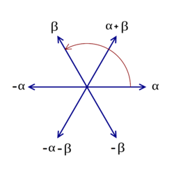

  

I've been re-reading parts of Carter's "Finite groups of Lie type" and Malle-Testerman's "Linear algebraic groups and finite groups of Lie type" with a view to understanding the theory of maximal tori in finite groups of Lie type. 

In this post I want to use the theory in those books to write down the orders of the maximal tori of $A_2(q)$, ${^2A_2(q)}$ and $G_2(q)$. I wanted to also do ${^2G_2(q)}$ but, so far, I haven't managed to write things down properly for the Ree and Suzuki groups, so I'll exclude these from what follows.

The general set-up is as follows: $G$ is a simple linear algebraic groups, and $F:G\to G$ is a Steinberg endomorphism, i.e. some power $F^m:G\to G$ is a Frobenius endomorphism of $G$. (Some of this theory works more generally -- for $G$ connected reductive -- and, in particular, this can be important when one studies centralizers inside a simple LAG's.... But I'm not going there just now.) Now a theorem of Steinberg asserts that $G^F$, the set of fixed-points of $F$, is a finite set [MT, Theorem 21.5] -- such a group is an example of a **finite group of Lie type**. 

Now the Lang-Steinberg theorem asserts that the map $L:G\to G, \, g\mapsto F(g) g^{-1}$ is surjective [MT, Theorem 21.7]. This theorem then implies that $G$ contains an $F$-stable maximal torus $T$ inside an $F$-stable Borel subgroup $B$. Since $T$ is $F$-stable, $N_G(T)$ is also $F$-stable, and so $F$ naturally acts on the Weyl group $W=N_G(T)/T$ of $G$. Similarly, $F$ acts on the character group $X:=X(T)$ via
\[
F(\chi(t)):= \chi(F(t)) for $\chi \in X, t\in T.
\]
We will need the notion of $F$-conjugacy in $W$: if $w_1, w_2\in W$, then $w_1$ is **$F$-conjugate** with $w_2$ if there exists $g\in W$ such that $w_1=F(g)w_2g^{-1}$.

Let $\Phi\subset X$ be the root system of $G$ with positive system $\Phi^+$ with respect to $T$ and $B$. In what follows we write $X_\mathbb{R}:=X\otimes_{\mathbb{Z}}\mathbb{R}$.

Now the first three results of [MT, Section 22.1] imply that 
 - there exists a natural number $\delta$ such that $F^\delta|\_X=r.1\_X$, where $r$ is some power of $p$;
 - there exists a permutation $\rho$ of $\Phi^+$ such that, for each $\alpha\in\Phi^+$, $F(\rho(\alpha)) = q_\alpha \alpha$ where $q_\alpha>1$ is a power of $p$;
 - the parameter $q_\alpha$ is constant on root lengths; moreover, either $q_\alpha=q$ or else $(G,p)\in\{(B_2,2), (G_2,3), (F_4,2)\}$, $\rho$ interchanges long and short roots, and $q_{long}.q_{short}=q^2$ with $q_{short}/q_{long}=p$;
 - setting $q=r^{1/\delta}$, we have that $F=q\phi$, where $q$ is the Frobenius endomorphism, and $\phi\in {\rm Aut}(X_\mathbb{R})$ is of order $\delta$ inducing $\rho^{-1}$ on $\Phi^+$;
 - $T^F=X/(F-1)/X$.

It is important to note that, in principle, $q$ is a fractional power of $p$ (although, in fact, it will be integral except when $G^F$ is Ree or Suzuki). Note, too, that this set-up clearly defines the real number $q$ to be associated to our finite group of Lie type -- for certain families (e.g. the unitaries), the value of $q$ follows varying conventions whereas here it is clear cut.

We have set-up all the necessary parameters associated with our group of Lie type. Now let's study the maximal tori: we follow [MT, Chapter 25]. First off, we note that, since Frobenius endomorphism commute with elements of $W$ in their action on $T$, the notion of $F$-conjugacy is the same as $\phi$-conjugacy (where $F=q\phi$).

The following principles are important:
 - [MT, Prop. 25.1] The $G^F$-classes of $F$-stable maximal tori of $G$ are in 1-1 correspondence with the $\phi$-conjugacy classes in $W$.
 - [MT, Exercise 30.5] The $G^F$-classes of subgroups of the form $T^F$ ($T$ an $F$-stable maximal torus of $G$) are in 1-1 correspondence with the two previous sets. (I'm slightly unsure of this... But it seems correct.)

These correspondences follow from the Lang-Steinberg theorem. More precisely the first correspondence is as follows: if $gTg^{-1}$ is $F$-stable, then it corresponds to the element $w:=g^{-1}F(g)T\in N_g(T)/T=W$. We are then able to write $T_w$ for the conjugate $gTg^{-1}$. Note that $T_1$ corresponds to an $F$-stable maximal torus in an $F$-stable Borel subgroup. Now [MT, Prop. 25.3] asserts:
 - $T\_w^F\cong X/(wF-1)X$;
 - $|T\_w^F| = |\det\_{X\otimes \mathbb{R}}(wF-1)| = \det\_{X\otimes \mathbb{R}}(q-(w\phi)^{-1}$.

Specific calculations now follow. These can be confirmed using Kantor-Seress "Primie power graphs for groups of Lie type".

---
##  Calculations for $A_2(q)$

We record the size of the maximal tori for $A_2(q)$. Note that, here and below, the isogeny class does not matter -- so, in this case, these calculations are valid for ${\rm PGL}_3(q)$ and ${\rm SL}_3(q)$.

We use the fact that the fundamental roots of $A_2$ -- labelled $\alpha$ and $\beta$ in the diagram -- form a basis for $X\otimes\mathbb{R}$. With respect to this basis we have
$$
q=\left(\begin{matrix} q & 0 \\ 0 & q \end{matrix}\right).
$$
In this case $\phi$ is trivial, so we just need to write down $q-w^{-1}$. The possibilities are as follows:
- $w=1$. Then $w=\left(\begin{matrix} 1 & 0 \\ 0 & 1\end{matrix}\right)$ and $\det(q-w^{-1}=\det\left(\begin{matrix} q-1 & 0 \\ 0 & q-1\end{matrix}\end{matrix}\right)
ight) = (q-1)^2.
- $w=Ref_\alpha$. Then $w=\left(\begin{matrix} -1 & 1\\ 0 & 1$ and $\det(q-w^{-1}=\det\left(\begin{matrix} q+1 & -1 \\ 0 & q-1\end{matrix}\right) = q^2-1.
- $w=Rot_{\pi/3}$. Then $w=\left(\begin{matrix} 0 & -1\\ 1 & -1$ and $\det(q-w^{-1}=\det\left(\begin{matrix} q & 1 \\ -1 & q+1\end{matrix}\right) = q^2+q+1.

---

##  Calculations for ${^2A_2}(q)$

We record the size of the maximal tori for ${^2A_2}(q)$. The root system is as before, and we have the same value for $q$, but this time time $\phi$ is non-trivial.

In this case $\phi$ is trivial, so we just need to write down $q-w^{-1}$. The possibilities are as follows:
- $w=1$. Then $w=\left(\begin{matrix} 1 & 0 \\ 0 & 1\end{matrix}\right)$ and $\det(q-w^{-1}=\det\left(\begin{matrix} q-1 & 0 \\ 0 & q-1\end{matrix}\end{matrix}\right)
ight) = (q-1)^2.
- $w=Ref_\alpha$. Then $w=\left(\begin{matrix} -1 & 1\\ 0 & 1$ and $\det(q-w^{-1}=\det\left(\begin{matrix} q+1 & -1 \\ 0 & q-1\end{matrix}\right) = q^2-1.
- $w=Rot_{\pi/3}$. Then $w=\left(\begin{matrix} 0 & -1\\ 1 & -1$ and $\det(q-w^{-1}=\det\left(\begin{matrix} q & 1 \\ -1 & q+1\end{matrix}\right) = q^2+q+1.

