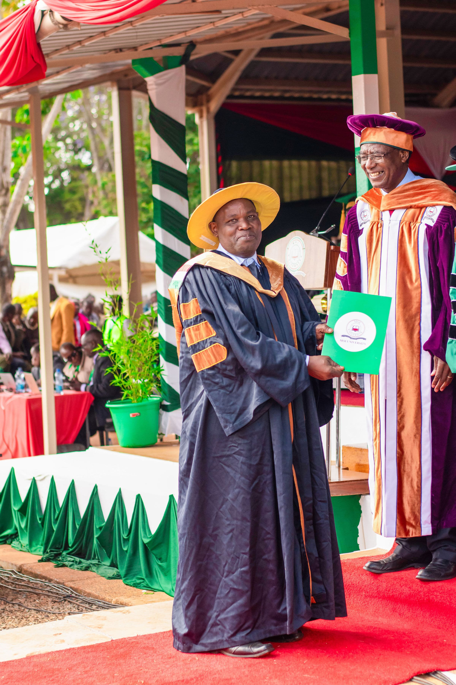
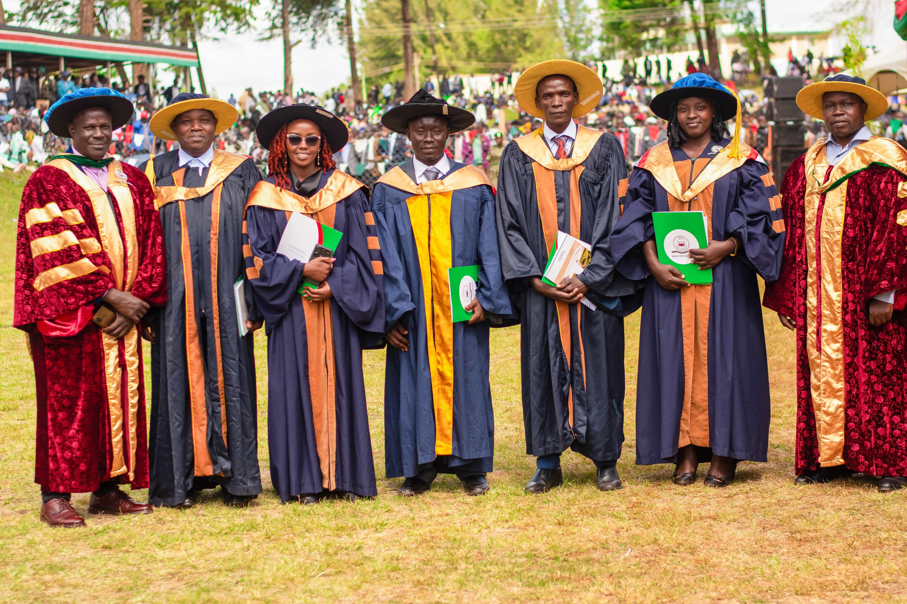

Congratulations to Kimeu Arphaxad Ngwava who has been awarded his PhD. His PhD thesis entitled *Calculating the minimal size of a nilpotent cover of the finite symmetric, alternating and dihedral groups*. I was the lead supervisor for Kimeu; my colleague, Ian Short, and Fredrick Nyamwala from Moi University in Kenya were the other supervisors. Kimeu's PhD was awarded by Moi University -- Ian and I supervised "from afar"!

Kimeu's work was impressive for many reasons. First, it produced two lovely papers:
 - [Nilpotent covers of symmetric and alternating groups](https://projecteuclid.org/journals/bulletin-of-the-belgian-mathematical-society-simon-stevin/volume-29/issue-2/Nilpotent-covers-of-symmetric-and-alternating-groups/10.36045/j.bbms.220218.short). The authors were Kimeu, Ian Short and I.
 - [Nilpotent covers of dihedral groups](https://combinatorialpress.com/article/ars/Volume%20160/nilpotent-covers-of-dihedral-groups.pdf). The authors were Kimeu and I.

More significantly (for me), I want to pay tribute to Kimeu's astounding perseverance and indefatigability in the face of tremendous obstacle. Kimeu enrolled in the doctoral programme at Moi in 2014 and spent two years completing courses. Then, in 2016, Ian and I started work with Kimeu, funded by the London Mathematical Society's [Mentoring African Research in Mathematics](https://www.lms.ac.uk/grants/marm) programme. That funding lasted for 2 years and during that period we initiated the programme of research that was the basis for Kimeu's PhD.

After several international visits (I visited Kenya twice, Kimeu came to the UK once), Kimeu was able to submit his thesis in 2021. He then had to wait **four years** before he was able to defend his thesis in a viva. The delay was caused by a multitude of complicated bureaucratic obstacles, strikes at Moi University, and the like. At times we wondered if the end would ever come.

But Kimeu kept at it. Throughout all of this time he was providing for his four children, Jane, Kelly, Emma and Yvonne. To make matters that much harder, he had to cope with a severe bout of malaria. 

But, still, he kept at it.

On 16 September 2025 Kimeu successfully defended his thesis. He faced one final hurdle: the final tranche of fees for his studies at Moi University were due -- [with the generous help of many supporters](https://www.justgiving.com/crowdfunding/kenya-phd) Kimeu was able to pay the fees. On 19 December 2026 Kimeu graduated. Cue much rejoicing.

Well done Kimeu, it has been a pleasure to work with you.

*Kimeu is second from the left. Dr Nyamwala, who supervised Kimeu along with Ian Short and I, is on the far left.*

