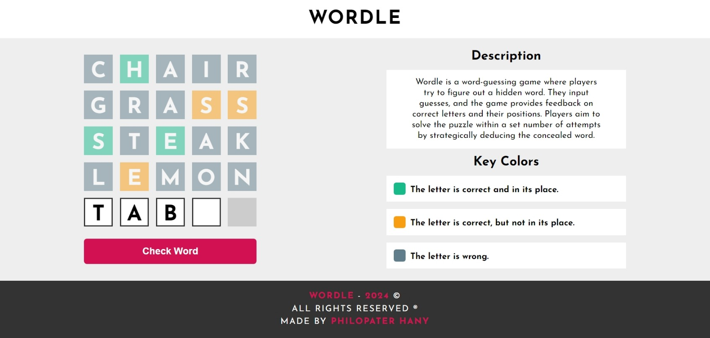

<h1 align="center">
    Wordle
    <br />
    <br />
    Unleash Your Vocabulary Power
</h1>



## Table of Contents

- [Overview](#overview)
  - [The Challenge](#the-challenge)
  - [Links](#links)
- [How To Play](#how-to-play)
- [My Approach](#our-approach)
  - [Technologies Used](#technologies-used)
  - [What I Learned](#what-we-learned)
  - [Useful Resources](#useful-resources)
- [Author](#author)

## Overview

Wordle is an engaging word game designed to challenge and enhance your vocabulary. Built with simplicity and fun in mind, it offers an interactive and enjoyable experience for players of all ages. Wordle is a browser-based game, allowing users to enjoy wordplay anytime, anywhere.

### The Challenge

Wordle aims to:

- Provide an entertaining and educational word game.
- Enhance players' vocabulary skills.
- Offer a user-friendly and enjoyable gaming experience.

Player can:
- Guess a word from a variety of words.
- Get a link for each word to check its meaning and see examples after finishing the game.

### Links

- Styling: [Fonts & Colors](https://github.com/PhilopaterHany/Wordle-Game/blob/main/style-guide.md)
- Live Demo: [Start Playing](https://philopaterhany.github.io/Wordle-Game/)

## How To Play

To enjoy Wordle, follow these simple steps:

1. Access the game through the provided link.
2. Guess letters to complete the word.
3. Focus on the colors after each guess so you can use the letters wisely.
4. Celebrate your victories and learn from defeats.
5. Learn new words and their meanings from the link provided after each game.

## My Approach

### Technologies Used

- Semantic HTML5 Markup
- CSS Custom Properties
- Vanilla Javascript
- Sweetalert2 (for pop-ups)
- Animate.css (for animations)

### What I learned

```js
if (event.key === "Backspace") {
    const inputs = document.querySelectorAll("input:not([disabled])");
    const currentIndex = Array.from(inputs).indexOf(document.activeElement);

    if (currentIndex >= 0) {
        const currentInput = inputs[currentIndex];
        const prevInput = inputs[currentIndex - 1];

        if (currentInput.value === "" && prevInput) {
            prevInput.value = "";
            prevInput.focus();
            currentInput.classList.remove("active");
        } else {
            currentInput.value = "";
        }
    }
}
```
### Useful Resources

- [Elzero Web School - Wordle Tutorial](https://youtu.be/e4P15Wc0wq8)
- [Sweetalert2 Documentation](https://sweetalert2.github.io/)
- [Animate.css Documentation](https://animate.style/)

## Author

-   Website - Portfolio Is Coming Out Soon!
-   Twitter - [@PhilopaterHany4](https://www.twitter.com/PhilopaterHany4/)
-   Linkedin - [@phth](https://www.linkedin.com/in/phth/)
-   Facebook - [Philopater Hany](https://www.facebook.com/philopater.hany.3)
-   Discord - [#8178](https://discord.com/#8178/)

Wordle is not just a game; it's a journey into the world of words. We invite you to explore, challenge yourself, and have fun with words. As we continue to improve Wordle, we look forward to creating more wordy adventures for you.

Thank you for choosing Wordle, where words come to play! 📚✨

Let the word games begin! 🎉🔠