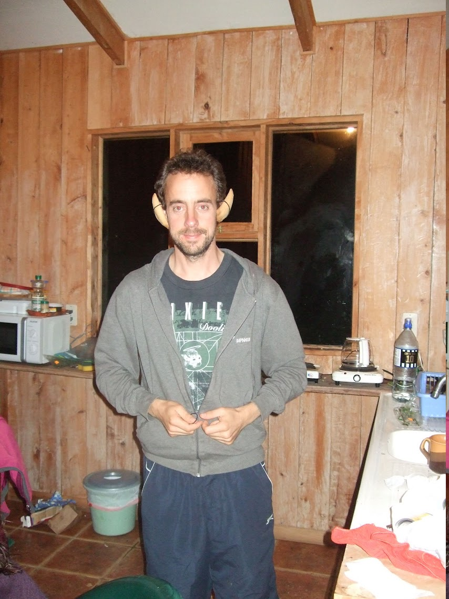

If you paid careful attention to the instructions on the first page, then you should know where to go for your first location... If you are struggling,  click here:

<table width="100%" cellspacing="20">
  <tr><td align="center"><button onclick="myFunction()">Hintypoos</button></td></tr>
</table>

Once you are at your first location, click <a href = "p4">here</a>

